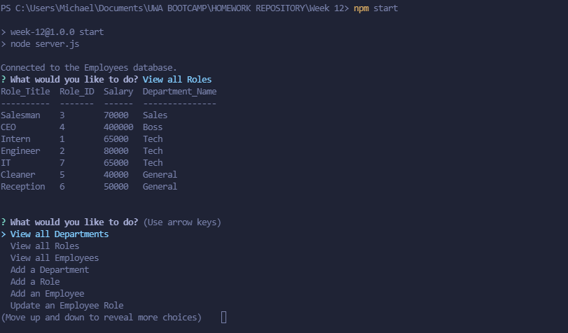

# Michael Ariti - Employee Database

[](https://opensource.org/licenses/MIT)

|  Table of Contents |
| ----------- |
| [1. Description.](#description)|
| [2. User Story.](#user-story) |
| [3. Acceptance Criteria.](#acceptance-criteria) |
| [4. Installation.](#installation) |
| [5. Usage.](#usage)|
| [6. License.](#license)|
| [7. Contributing.](#contributing)|
| [8. Technologies Used.](#technologies-used)|
| [9. Screenshot.](#screenshot)|
| [10. Video Demo.](#video-demo)|
| [121 Questions.](#questions)|

## Description

The purpose of this repository is to create a javascript app that runs in node which will allow a user to create and maintain an employee database. Features the sbility to view by Employee, Role, Department, Employee by Manager, Employee by Department and the Total utilized budget per Department. User can add or delete employees, roles and departments. User can update and employee's manager or role.

## User Story

```md
AS A business owner
I WANT to be able to view and manage the departments, roles, and employees in my company
SO THAT I can organize and plan my business
```

## Acceptance Criteria

```md
GIVEN a command-line application that accepts user input
WHEN I start the application
THEN I am presented with the following options: view all departments, view all roles, view all employees, add a department, add a role, add an employee, and update an employee role
WHEN I choose to view all departments
THEN I am presented with a formatted table showing department names and department ids
WHEN I choose to view all roles
THEN I am presented with the job title, role id, the department that role belongs to, and the salary for that role
WHEN I choose to view all employees
THEN I am presented with a formatted table showing employee data, including employee ids, first names, last names, job titles, departments, salaries, and managers that the employees report to
WHEN I choose to add a department
THEN I am prompted to enter the name of the department and that department is added to the database
WHEN I choose to add a role
THEN I am prompted to enter the name, salary, and department for the role and that role is added to the database
WHEN I choose to add an employee
THEN I am prompted to enter the employee’s first name, last name, role, and manager, and that employee is added to the database
WHEN I choose to update an employee role
THEN I am prompted to select an employee to update and their new role and this information is updated in the database 
```

## Installation

To install this app you are required to have MySQL set up and configured. Open the server.js file in a node terminal and use the command npm install to install the dependancies. Copy and rename the .env.EXAMPLE file as .env and then add your MYSQL details to the .env file (user is default set to root and host is default set to local host.) then open another terminal on the schema.sql run the command mysql -u root -p to start the mysql, then run source schema.sql to initialise the databse. If you wish to use the seed values then run source seeds.sql. After this go back to the node terminal and run npm start to begin the app. 

## Usage

To use this app open the terminal and run the command 'node .\App\index.js'. HTML file will output into the '.\App\dist' Folder.

## License

This project uses the MIT license.

## Contributing

If you would like to contribute to the project please message my github.

## Technologies Used

1. Javascript
2. Node.js
3. SQL

## Screenshot


## Video Demo
[Video-Demo](https://drive.google.com/file/d/1InkmcvSq1GwQ8K4DTxmySOYP21lP0pDT/view?usp=sharing)

## Questions

### Email
MichaelAriti94@gmail.com

### End

Michael Ariti 2022